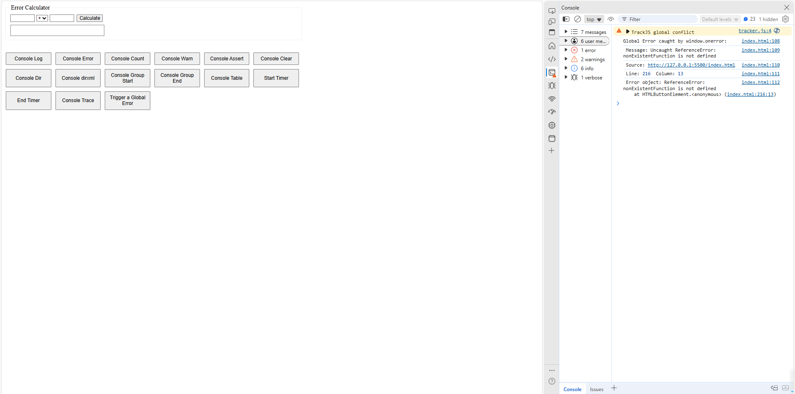

# Lab 9 - JavaScript Error Handling, Monitoring, & JS Docs

A simple demo of:
1. Console API buttons
2. Error Calculator with try/catch/finally and custom Errors
3. Global error handling (`window.onerror`)
4. TrackJS integration and dashboard screenshots

## Screenshots

1. **Console API Demo**  
   Clicking each button triggers a different `console.*` method (log, error, count, warn, assert, clear, dir, dirxml, group, table, time, trace).  
   

2. **Error Calculator**  
   Enter two numbers and an operator (`+`, `-`, `*`, `/`). Errors (empty input, NaN, divide-by-zero, invalid operator) are caught and shown below.  
   

3. **Global Error Capture (`window.onerror`)**  
   Clicking “Trigger a Global Error” calls an undefined function, and `window.onerror` logs the details in the console.  
   

4. **TrackJS “Errors” List**  
   After adding TrackJS, we manually run `TrackJS.track('Testing TrackJS!')` and click “Trigger a Global Error” again. The TrackJS dashboard shows both the custom message and the ReferenceError.  
   

## link : 
https://boscoliu0.github.io/Lab9_Starter/
